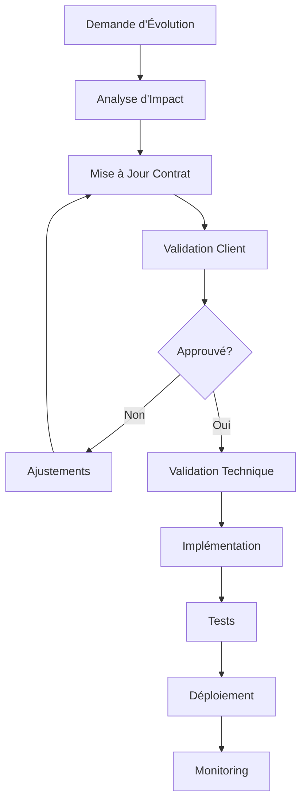

# 11h00 - 12h30 : "Context Engineering Patterns" (90min)

# Template - Contrat de Contexte

Ce document constitue un **Contrat de Contexte** fonctionnel qui définit précisément les exigences contextuelles pour un agent IA. Il sert d'interface de communication entre le Product Owner, le client et l'équipe de développement.

---

## 📋 Informations Générales

### Identification du Contrat

| Champ                            | Valeur                                          |
| -------------------------------- | ----------------------------------------------- |
| **ID Contrat**             | `CC-[PROJET]-[AGENT]-[VERSION]`               |
| **Nom de l'Agent**         | `[Nom fonctionnel de l'agent]`                |
| **Version**                | `[X.Y.Z]`                                     |
| **Date de Création**      | `[YYYY-MM-DD]`                                |
| **Dernière Mise à Jour** | `[YYYY-MM-DD]`                                |
| **Statut**                 | `[Brouillon/Validé/Approuvé/En Production]` |

### Parties Prenantes

| Rôle                       | Nom       | Email       | Responsabilité                         |
| --------------------------- | --------- | ----------- | --------------------------------------- |
| **Product Owner**     | `[Nom]` | `[email]` | Définition fonctionnelle et validation |
| **Client/Métier**    | `[Nom]` | `[email]` | Expression du besoin et acceptation     |
| **Lead Développeur** | `[Nom]` | `[email]` | Implémentation technique               |
| **Architecte IA**     | `[Nom]` | `[email]` | Conception du contexte                  |

---

## 🎯 Définition Fonctionnelle de l'Agent

### Mission de l'Agent

**Description** : `[Description claire et concise de ce que fait l'agent]`

**Objectif Métier** : `[Impact attendu sur le processus métier]`

**Périmètre** : `[Limites fonctionnelles de l'agent]`

### Cas d'Usage Principaux

#### Cas d'Usage #1

- **Nom** : `[Nom du cas d'usage]`
- **Déclencheur** : `[Événement qui déclenche ce cas]`
- **Acteurs** : `[Qui est impliqué]`
- **Résultat Attendu** : `[Ce qui doit être produit]`
- **Critères de Succès** : `[Comment mesurer le succès]`

#### Cas d'Usage #2

- **Nom** : `[Nom du cas d'usage]`
- **Déclencheur** : `[Événement qui déclenche ce cas]`
- **Acteurs** : `[Qui est impliqué]`
- **Résultat Attendu** : `[Ce qui doit être produit]`
- **Critères de Succès** : `[Comment mesurer le succès]`

---

## 🧠 Spécification du Contexte

### 1. Instructions Système

#### Rôle et Personnalité

```
Tu es [description du rôle de l'agent].

Tes caractéristiques principales :
- [Trait 1 : expertise, spécialisation]
- [Trait 2 : style de communication]
- [Trait 3 : approche méthodologique]

Ton objectif est de [objectif principal en une phrase].
```

#### Règles de Comportement

```
Règles obligatoires :
1. [Règle 1 - ex: Toujours vérifier les données avant de répondre]
2. [Règle 2 - ex: Respecter la confidentialité des données client]
3. [Règle 3 - ex: Escalader en cas d'ambiguïté]

Règles interdites :
1. [Interdiction 1 - ex: Ne jamais divulguer d'informations sensibles]
2. [Interdiction 2 - ex: Ne pas prendre de décisions sans validation]
3. [Interdiction 3 - ex: Ne pas modifier les données sans autorisation]
```

#### Format de Réponse Attendu

```
Structure de réponse :
1. [Section 1 : Résumé de la situation]
2. [Section 2 : Analyse effectuée]
3. [Section 3 : Recommandation/Action]
4. [Section 4 : Prochaines étapes]

Contraintes de format :
- Langue : [Français/Multilingue selon détection]
- Longueur : [Minimum X mots, Maximum Y mots]
- Style : [Professionnel/Empathique/Technique]
- Niveau : [Grand public/Expert/Technique]
```

### 2. Sources de Connaissance

#### Sources de Données Obligatoires

| Source               | Type                   | Description                    | Fréquence de Mise à Jour               | Criticité                         |
| -------------------- | ---------------------- | ------------------------------ | ---------------------------------------- | ---------------------------------- |
| `[Nom Système 1]` | `[API/Base/Fichier]` | `[Description des données]` | `[Temps réel/Quotidien/Hebdomadaire]` | `[Critique/Important/Optionnel]` |
| `[Nom Système 2]` | `[API/Base/Fichier]` | `[Description des données]` | `[Temps réel/Quotidien/Hebdomadaire]` | `[Critique/Important/Optionnel]` |

#### Exemple de Récupération de Données

```json
{
  "source": "[nom_système]",
  "endpoint": "[URL ou chemin]",
  "methode": "[GET/POST/etc.]",
  "parametres_requis": [
    {
      "nom": "[nom_parametre]",
      "type": "[string/int/date]",
      "obligatoire": true,
      "description": "[description du parametre]"
    }
  ],
  "format_reponse": {
    "type": "[JSON/XML/CSV]",
    "structure": "[description de la structure]"
  },
  "gestion_erreurs": [
    {
      "code_erreur": "[404/500/etc.]",
      "action": "[comportement attendu]"
    }
  ]
}
```

#### Base de Connaissance Métier

| Domaine         | Documents Source          | Règles Clés             | Mise à Jour                 |
| --------------- | ------------------------- | ------------------------- | ---------------------------- |
| `[Domaine 1]` | `[Liste des documents]` | `[Règles principales]` | `[Responsable/Fréquence]` |
| `[Domaine 2]` | `[Liste des documents]` | `[Règles principales]` | `[Responsable/Fréquence]` |

### 3. Outils Disponibles

#### Outils Système

| Nom de l'Outil    | Description Fonctionnelle | Paramètres d'Entrée       | Sortie Attendue        | Conditions d'Usage     |
| ----------------- | ------------------------- | --------------------------- | ---------------------- | ---------------------- |
| `[nom_outil_1]` | `[Ce que fait l'outil]` | `[Liste des paramètres]` | `[Format de sortie]` | `[Quand l'utiliser]` |
| `[nom_outil_2]` | `[Ce que fait l'outil]` | `[Liste des paramètres]` | `[Format de sortie]` | `[Quand l'utiliser]` |

#### Exemple de Définition d'Outil

```json
{
  "nom": "[nom_fonctionnel]",
  "description": "[Description métier de la fonction]",
  "cas_usage": "[Quand et pourquoi utiliser cet outil]",
  "parametres": [
    {
      "nom": "[nom_parametre]",
      "description": "[Description métier]",
      "type": "[type de donnée]",
      "obligatoire": true,
      "valeurs_possibles": "[liste ou contraintes]",
      "exemple": "[exemple concret]"
    }
  ],
  "sortie": {
    "description": "[Description métier du résultat]",
    "format": "[structure attendue]",
    "gestion_erreurs": "[comportement en cas d'erreur]"
  }
}
```

### 4. Gestion de la Mémoire

#### Mémoire de Session

- **Durée de Vie** : `[Durée de la session utilisateur]`
- **Informations Conservées** : `[Liste des éléments à retenir]`
- **Limite de Capacité** : `[Nombre max d'éléments ou tokens]`

#### Mémoire Persistante

- **Données Client** : `[Informations client à conserver entre sessions]`
- **Apprentissages** : `[Patterns et règles apprises]`
- **Historique** : `[Interactions significatives à conserver]`

#### Exemple de Structure Mémoire

```json
{
  "session": {
    "user_id": "[identifiant]",
    "preferences": {
      "langue": "[fr/en/ar/es]",
      "niveau_detail": "[basique/detaille/expert]",
      "canal_communication": "[email/chat/telephone]"
    },
    "contexte_actuel": {
      "dossier_en_cours": "[reference]",
      "etape_processus": "[qualification/analyse/reponse]",
      "donnees_collectees": "[informations rassemblées]"
    }
  },
  "historique": [
    {
      "timestamp": "[date-heure]",
      "action": "[action effectuee]",
      "resultat": "[resultat obtenu]",
      "apprentissage": "[pattern identifie]"
    }
  ]
}
```

### 5. État et Contexte Externe

#### État du Monde

- **Systèmes Externes** : `[État des systèmes connectés]`
- **Données Temporelles** : `[Informations dépendantes du temps]`
- **Contraintes Opérationnelles** : `[Limitations actuelles]`

#### Variables d'Environnement

```json
{
  "environnement": {
    "mode": "[production/test/developpement]",
    "region": "[zone géographique]",
    "langue_defaut": "[langue par defaut]",
    "timezone": "[fuseau horaire]"
  },
  "contraintes_operationnelles": {
    "heures_ouverture": "[plages horaires]",
    "charge_systeme": "[normale/elevee/critique]",
    "maintenance_prevue": "[dates de maintenance]"
  }
}
```

---

## 🔧 Spécifications Techniques

### Contraintes de Performance

| Métrique                    | Valeur Cible          | Valeur Limite        | Mesure                       |
| ---------------------------- | --------------------- | -------------------- | ---------------------------- |
| **Temps de Réponse**  | `[X secondes]`      | `[Y secondes max]` | `[Temps total traitement]` |
| **Utilisation Tokens** | `[X tokens moyens]` | `[Y tokens max]`   | `[Contexte + réponse]`    |
| **Précision**         | `[X% minimum]`      | `[Y% acceptable]`  | `[Validation métier]`     |
| **Disponibilité**     | `[X% uptime]`       | `[Y% minimum]`     | `[Temps de service]`       |

### Gestion des Erreurs

#### Types d'Erreurs et Comportements

| Type d'Erreur                    | Cause                       | Comportement Attendu                                 | Escalade                    |
| -------------------------------- | --------------------------- | ---------------------------------------------------- | --------------------------- |
| **Données Manquantes**    | `[Source indisponible]`   | `[Demander confirmation/Utiliser défaut]`         | `[Automatique/Manuelle]`  |
| **Données Incohérentes** | `[Conflit entre sources]` | `[Prioriser source fiable/Demander clarification]` | `[Validation humaine]`    |
| **Limite de Contexte**     | `[Trop d'informations]`   | `[Compression intelligente/Priorisation]`          | `[Log pour optimisation]` |
| **Erreur Système**        | `[Panne technique]`       | `[Mode dégradé/Message d'erreur]`                | `[Support technique]`     |

### Sécurité et Conformité

#### Données Sensibles

| Type de Donnée                 | Niveau de Sensibilité | Traitement                 | Accès Autorisé         |
| ------------------------------- | ---------------------- | -------------------------- | ------------------------ |
| `[Données personnelles]`     | `[Élevé]`          | `[Chiffrement/Masquage]` | `[Rôles autorisés]`  |
| `[Données financières]`     | `[Critique]`         | `[Audit/Traçabilité]`  | `[Validation requise]` |
| `[Données opérationnelles]` | `[Modéré]`         | `[Log d'accès]`         | `[Selon habilitation]` |

#### Règles de Confidentialité

```
1. Ne jamais exposer de données client à un autre client
2. Masquer les informations sensibles selon le profil utilisateur
3. Tracer tous les accès aux données personnelles
4. Respecter les préférences de communication client
5. Appliquer le principe de minimisation des données
```

---

## 📊 Exemples de Contexte

### Exemple 1 : Contexte Nominal

#### Situation

```
Client Premium contacte pour une réclamation de retard de vol.
Vol AF1234 du 15/01/2025, retard de 4 heures.
Client avec statut Gold Safar Flyer.
```

#### Contexte Assemblé Attendu

```markdown
## Instructions Système
Tu es un agent spécialisé dans le traitement des réclamations de retard de vol.
Tu dois analyser la situation et déterminer l'éligibilité selon le règlement CE 261/2004.

## Profil Client
- ID: SF123456
- Statut: Gold Safar Flyer
- Langue préférée: Français
- Historique: 3 réclamations traitées (2 approuvées, 1 rejetée)

## Données de Vol
- Vol: AF1234
- Date: 15/01/2025
- Origine: Paris (CDG)
- Destination: Casablanca (CMN)
- Retard: 4 heures (départ prévu 14h00, départ effectif 18h00)
- Cause: Conditions météorologiques exceptionnelles

## Règles Applicables
- Règlement CE 261/2004: Vol > 3500km, retard > 3h = 600€
- Exceptions: Conditions météorologiques extraordinaires
- Politique RAM: Geste commercial pour clients Gold

## Outils Disponibles
- check_eu_regulation(flight_data, delay_info)
- calculate_compensation(distance, delay_duration, passenger_class)
- get_commercial_gesture_options(customer_tier, situation)

## Résultat Attendu
Analyse d'éligibilité avec justification et montant exact.
```

### Exemple 2 : Contexte d'Exception

#### Situation

```
Réclamation sans numéro de vol identifiable.
Message en arabe dialectal.
Première interaction client.
```

#### Contexte Assemblé Attendu

```markdown
## Instructions Système
Tu es en mode résolution d'ambiguïté.
Ton objectif est de qualifier la réclamation avec les informations disponibles.

## Profil Client
- Statut: Non identifié
- Langue détectée: Arabe (dialectal)
- Première interaction: Oui
- Données disponibles: Email uniquement

## Données Partielles
- Message original: [contenu en arabe]
- Translation tentative: [traduction approximative]
- Éléments extraits: [mots-clés identifiés]

## Outils de Qualification
- translate_text(text, source_lang, target_lang)
- extract_flight_references(text)
- search_customer_by_email(email)
- request_additional_information(customer_contact, required_fields)

## Résultat Attendu
Plan de qualification avec demande d'informations complémentaires.
```

---

## ⚙️ Configuration du Context Engineering

### Stratégies d'Assemblage

#### Stratégie par Défaut

```json
{
  "nom": "standard_claim_processing",
  "description": "Traitement standard des réclamations",
  "composants": {
    "instructions": {
      "priorite": 1,
      "compression": false,
      "template": "instructions_reclamation_standard"
    },
    "donnees_client": {
      "priorite": 2,
      "compression": false,
      "sources": ["hubspot", "altea", "crane"]
    },
    "regles_metier": {
      "priorite": 3,
      "compression": true,
      "filtre_pertinence": 0.8
    },
    "historique": {
      "priorite": 4,
      "compression": true,
      "limite_elements": 5
    }
  },
  "optimisation": {
    "limite_tokens": 4000,
    "strategie_compression": "semantique",
    "seuil_pertinence": 0.7
  }
}
```

#### Stratégies Alternatives

| Situation                       | Stratégie           | Description                              | Configuration                                       |
| ------------------------------- | -------------------- | ---------------------------------------- | --------------------------------------------------- |
| **Client VIP**            | `vip_enhanced`     | Contexte enrichi avec historique complet | `{limite_tokens: 6000, historique: "complet"}`    |
| **Cas Complexe**          | `complex_analysis` | Maximum d'informations pour analyse      | `{limite_tokens: 8000, sources: "toutes"}`        |
| **Traitement Rapide**     | `quick_resolution` | Contexte minimal pour efficacité        | `{limite_tokens: 2000, compression: "agressive"}` |
| **Première Interaction** | `onboarding`       | Contexte pédagogique et guidé          | `{templates: "explicatifs", aide: true}`          |

### Règles de Sélection du Contexte

#### Matrice de Décision

| Critère                           | Valeur         | Action Contexte                              |
| ---------------------------------- | -------------- | -------------------------------------------- |
| **Type Client**              | VIP/Premium    | Enrichissement historique complet            |
| **Type Client**              | Standard       | Contexte standard optimisé                  |
| **Complexité Réclamation** | Élevée       | Contexte détaillé + outils avancés        |
| **Complexité Réclamation** | Faible         | Contexte minimal + traitement rapide         |
| **Langue Client**            | Non-française | Ajout contexte culturel + templates adaptés |
| **Première Visite**         | Oui            | Contexte pédagogique + guides               |

#### Algorithme de Sélection

```python
def select_context_strategy(client_profile, claim_data, system_state):
    """
    Sélectionne la stratégie de contexte appropriée
  
    Args:
        client_profile: Profil du client (tier, langue, historique)
        claim_data: Données de la réclamation (type, complexité)
        system_state: État du système (charge, disponibilité)
  
    Returns:
        strategy_name: Nom de la stratégie à appliquer
    """
  
    # Logique de décision
    if client_profile.tier in ['VIP', 'Platinum']:
        if claim_data.complexity == 'high':
            return 'vip_complex_analysis'
        else:
            return 'vip_enhanced'
  
    elif claim_data.complexity == 'high':
        if system_state.load < 0.7:
            return 'complex_analysis'
        else:
            return 'standard_with_escalation'
  
    elif client_profile.is_first_interaction:
        return 'onboarding'
  
    else:
        return 'standard_claim_processing'
```

---

## 📈 Métriques et Validation

### Critères de Validation Fonctionnelle

#### Validation Client (Acceptation Métier)

| Critère                 | Description                                        | Méthode de Test           | Seuil d'Acceptation |
| ------------------------ | -------------------------------------------------- | -------------------------- | ------------------- |
| **Compréhension** | L'agent comprend correctement la demande           | Test avec cas réels       | `≥ 95%`          |
| **Pertinence**     | Les réponses sont adaptées au contexte           | Évaluation expert métier | `≥ 90%`          |
| **Completude**     | Toutes les informations nécessaires sont fournies | Check-list validation      | `≥ 95%`          |
| **Conformité**    | Respect des règles métier et réglementaires     | Audit conformité          | `100%`            |

#### Validation Développeur (Performance Technique)

| Métrique                      | Description                                  | Méthode de Mesure      | Objectif    |
| ------------------------------ | -------------------------------------------- | ----------------------- | ----------- |
| **Temps Assemblage**     | Durée pour assembler le contexte            | Monitoring automatique  | `< 500ms` |
| **Utilisation Mémoire** | RAM utilisée pour le contexte               | Profiling système      | `< 512MB` |
| **Taux de Cache Hit**    | Efficacité du cache de contexte             | Métriques applicatives | `> 80%`   |
| **Stabilité**           | Cohérence des réponses pour même contexte | Tests de régression    | `> 95%`   |

### Tests d'Acceptation

#### Scénarios de Test Obligatoires

##### Test 1 : Cas Nominal

```gherkin
Étant donné un client Premium avec une réclamation de retard
Quand l'agent analyse la situation  
Alors il doit identifier correctement l'éligibilité
Et calculer le montant exact d'indemnisation
Et proposer une réponse dans la langue du client
```

##### Test 2 : Cas d'Exception

```gherkin
Étant donné une réclamation avec des données manquantes
Quand l'agent tente de qualifier la réclamation
Alors il doit identifier les informations manquantes
Et demander les compléments nécessaires
Et mettre en attente le traitement
```

##### Test 3 : Cas de Charge

```gherkin
Étant donné un pic de charge système
Quand l'agent traite une réclamation
Alors il doit adapter son contexte (compression)
Et maintenir la qualité de service
Et respecter les SLA définis
```

---

## 🔄 Processus de Validation et Évolution

### Cycle de Validation

#### Phase 1 : Validation Fonctionnelle (Product Owner ↔ Client)

1. **Revue du Besoin** : Validation de la mission et des cas d'usage
2. **Validation des Exemples** : Vérification des contextes d'exemple
3. **Test d'Acceptation** : Exécution des scénarios métier
4. **Ajustements** : Modifications selon feedback client

#### Phase 2 : Validation Technique (Product Owner ↔ Développeur)

1. **Faisabilité Technique** : Validation de la réalisabilité
2. **Architecture du Contexte** : Validation de la structure technique
3. **Performance** : Vérification des contraintes de performance
4. **Intégration** : Validation des interfaces système

### Processus d'Évolution

#### Déclencheurs d'Évolution

- **Feedback Client** : Insatisfaction ou nouvelles demandes
- **Performance Dégradée** : Métriques en dessous des seuils
- **Évolution Réglementaire** : Changements de règles métier
- **Optimisation** : Opportunités d'amélioration identifiées

#### Processus de Mise à Jour



---

## 📝 Template de Remplissage

### Section À Compléter par le Product Owner

```markdown
## INFORMATIONS PROJET

**Nom du Projet** : [Nom du projet]
**Agent Concerné** : [Nom de l'agent]
**Objectif Métier** : [Objectif en une phrase]

## BESOINS CLIENT

**Problème à Résoudre** : 
[Description du problème métier que l'agent doit résoudre]

**Utilisateurs Finaux** :
- [Type d'utilisateur 1] : [Besoins spécifiques]
- [Type d'utilisateur 2] : [Besoins spécifiques]

**Contraintes Métier** :
- [Contrainte 1]
- [Contrainte 2]
- [Contrainte 3]

## DONNÉES NÉCESSAIRES

**Sources de Données Identifiées** :
1. [Source 1] : [Type de données] - [Fréquence de mise à jour]
2. [Source 2] : [Type de données] - [Fréquence de mise à jour]
3. [Source 3] : [Type de données] - [Fréquence de mise à jour]

**Règles Métier** :
- [Règle 1] : [Description et conditions d'application]
- [Règle 2] : [Description et conditions d'application]
- [Règle 3] : [Description et conditions d'application]

## COMPORTEMENTS ATTENDUS

**Scénarios Prioritaires** :
1. [Scénario 1] : [Description] → [Comportement attendu]
2. [Scénario 2] : [Description] → [Comportement attendu]
3. [Scénario 3] : [Description] → [Comportement attendu]

**Gestion des Exceptions** :
- [Exception 1] : [Comment l'agent doit réagir]
- [Exception 2] : [Comment l'agent doit réagir]
- [Exception 3] : [Comment l'agent doit réagir]
```

### Section À Compléter par l'Équipe Technique

```markdown
## IMPLÉMENTATION TECHNIQUE

**Architecture Proposée** :
- [Description de l'architecture technique]
- [Choix technologiques justifiés]
- [Patterns d'implémentation]

**Intégrations Système** :
1. [Système 1] : [Type d'intégration] - [API/Base/Fichier]
2. [Système 2] : [Type d'intégration] - [API/Base/Fichier]
3. [Système 3] : [Type d'intégration] - [API/Base/Fichier]

**Gestion du Contexte** :
- **Assemblage** : [Méthode d'assemblage du contexte]
- **Optimisation** : [Stratégies d'optimisation]
- **Cache** : [Politique de mise en cache]
- **Compression** : [Méthodes de compression si nécessaire]

**Métriques Techniques** :
- **Performance** : [Temps de réponse visé]
- **Scalabilité** : [Charge maximale supportée]
- **Disponibilité** : [SLA technique]
- **Sécurité** : [Mesures de sécurité implémentées]
```

---

## ✅ Checklist de Validation

### Validation Fonctionnelle

- [ ] **Mission de l'agent clairement définie**
- [ ] **Cas d'usage documentés avec exemples**
- [ ] **Sources de données identifiées et validées**
- [ ] **Règles métier formalisées**
- [ ] **Comportements d'exception définis**
- [ ] **Critères de succès mesurables**
- [ ] **Tests d'acceptation rédigés**
- [ ] **Validation client obtenue**

### Validation Technique

- [ ] **Faisabilité technique confirmée**
- [ ] **Architecture du contexte validée**
- [ ] **Intégrations système spécifiées**
- [ ] **Contraintes de performance définies**
- [ ] **Stratégies d'optimisation planifiées**
- [ ] **Gestion des erreurs implémentée**
- [ ] **Sécurité et conformité assurées**
- [ ] **Plan de monitoring défini**

### Validation Croisée

- [ ] **Alignement besoin client ↔ spécification technique**
- [ ] **Cohérence entre exemples et implémentation**
- [ ] **Traçabilité des exigences**
- [ ] **Documentation complète et à jour**
- [ ] **Formation des équipes planifiée**

---

## 📋 Annexes

### Annexe A : Glossaire

| Terme                             | Définition                                                       |
| --------------------------------- | ----------------------------------------------------------------- |
| **Context Engineering**     | Discipline de conception et optimisation du contexte pour LLM     |
| **Assemblage de Contexte**  | Processus de construction du contexte à partir de composants     |
| **Fenêtre de Contexte**    | Limite en tokens que peut traiter le modèle                      |
| **Compression Sémantique** | Réduction du contexte en préservant le sens                     |
| **Isolation Contextuelle**  | Séparation des types de contexte pour éviter les interférences |

### Annexe B : Templates de Communication

#### Email de Validation Client

```
Objet: Validation du Contrat de Contexte - [Nom Agent]

Bonjour [Nom Client],

Nous avons finalisé le Contrat de Contexte pour l'agent [Nom Agent].

Ce document définit précisément :
- La mission de l'agent
- Les données qu'il utilisera
- Les comportements attendus
- Les critères de validation

Merci de valider les sections suivantes :
1. Mission et objectifs (Section 2)
2. Cas d'usage (Section 2.2)
3. Exemples de contexte (Section 6)

Votre validation nous permettra de procéder à l'implémentation technique.

Cordialement,
[Product Owner]
```

#### Email de Validation Technique

```
Objet: Spécifications Techniques - Contrat de Contexte [Nom Agent]

Bonjour [Équipe Dev],

Le Contrat de Contexte pour [Nom Agent] est validé côté métier.

Points d'attention pour l'implémentation :
- Contraintes de performance (Section 4.1)
- Intégrations système requises (Section 3.2)
- Gestion des erreurs (Section 4.2)
- Sécurité et conformité (Section 4.3)

Merci de confirmer la faisabilité et proposer l'architecture technique.

Planning prévu :
- Développement : [dates]
- Tests : [dates]  
- Mise en production : [dates]

Cordialement,
[Product Owner]
```

### Annexe C : Exemple Complet - Agent de Classification Royal Air Maroc

```markdown
## CONTRAT DE CONTEXTE - AGENT DE CLASSIFICATION

### Informations Générales
- **ID Contrat** : CC-RAM-CLASSIFICATION-1.0
- **Agent** : Agent de Classification et Dispatch
- **Version** : 1.0
- **Statut** : Validé

### Mission
Analyser automatiquement les réclamations clients et les router vers les équipes appropriées selon leur type, priorité et complexité.

### Sources de Données
1. **HubSpot CRM** : Nouveaux tickets, messages clients
2. **Altea** : Données de réservation et vol pour contexte
3. **Base de Règles** : Critères de classification RAM
4. **Système RH** : Charge des équipes et disponibilités

### Outils Disponibles
- `classify_claim_type(message, attachments)`
- `determine_priority(client_tier, claim_type, urgency)`
- `route_to_team(claim_data, team_availability)`
- `update_hubspot_tags(ticket_id, classification_data)`

### Contexte d'Exemple
```

## Instructions Système

Tu es l'agent de classification de Royal Air Maroc.
Analyse chaque réclamation et détermine le routage optimal.

## Nouvelle Réclamation

- ID: TICK-2025-001
- Client: Jean Dupont (Gold Safar Flyer)
- Message: "Mon vol AT123 du 15/01 a été annulé..."
- Pièces jointes: billet_electronique.pdf

## Données de Vol (Altea)

- Vol: AT123
- Date: 15/01/2025
- Statut: Annulé (météo)
- Passagers affectés: 156

## Équipes Disponibles

- Irrégularités: 3 agents (charge: 70%)
- Bagages: 2 agents (charge: 45%)
- VIP: 1 agent (charge: 30%)

## Classification Attendue

Type: Irrégularité vol
Priorité: Élevée (client Gold + annulation)
Équipe: VIP (client Gold disponible)

```

### Critères de Succès
- Classification correcte : ≥ 95%
- Temps de traitement : < 30 secondes
- Satisfaction équipes : ≥ 4/5
```

---

## 💡 Conseils d'Usage

### Pour le Product Owner

1. **Soyez Spécifique** : Plus le contexte est précis, meilleur sera le résultat
2. **Pensez aux Exceptions** : Documentez tous les cas particuliers
3. **Validez avec des Exemples** : Utilisez des cas réels pour valider
4. **Itérez** : Le contrat de contexte évolue avec la compréhension

### Pour le Client

1. **Exprimez Clairement vos Attentes** : Décrivez précisément le comportement souhaité
2. **Fournissez des Exemples** : Donnez des cas concrets de votre métier
3. **Identifiez les Contraintes** : Mentionnez toutes les limitations importantes
4. **Participez aux Tests** : Validez les comportements avec des cas réels

### Pour les Développeurs

1. **Respectez le Contrat** : Implémentez exactement ce qui est spécifié
2. **Optimisez les Performances** : Utilisez les stratégies définies
3. **Documentez les Écarts** : Signalez toute impossibilité technique
4. **Proposez des Améliorations** : Suggérez des optimisations possibles

---

*Template créé pour faciliter la communication et assurer la qualité du Context Engineering dans les projets d'agents IA.*

## 📚 **Sources et références récentes**

### Context Engineering Patterns (2024-2025)

- [Context Engineering in LLMs and AI Agents | Medium](https://medium.com/@danushidk507/context-engineering-in-llms-and-ai-agents-eb861f0d3e9b) - Patterns pratiques (juillet 2025)
- [A Technical Roadmap to Context Engineering in LLMs: Mechanisms, Benchmarks](https://www.marktechpost.com/2025/08/03/a-technical-roadmap-to-context-engineering-in-llms-mechanisms-benchmarks-and-open-challenges/) - Roadmap technique (août 2025)
- [The New Skill in AI is Not Prompting, It&#39;s Context Engineering](https://www.philschmid.de/context-engineering) - Vision d'expert

### RAG et Multi-Modal

- [Context Engineering for Agents | LangChain Blog](https://blog.langchain.com/context-engineering-for-agents/) - Implémentations pratiques

**6 mini-ateliers de 15min chacun :**

1. **Prompt Chaining** : Séquence de 3 prompts interdépendants
2. **Conditional Loading** : Rules qui s'activent selon le contexte
3. **Memory Patterns** : Garder l'historique des décisions
4. **RAG Simple** : Agent qui interroge de la documentation
5. **Multi-Modal** : Agent qui traite code + images/diagrammes
6. **Error Recovery** : Agent qui corrige ses propres erreurs

**Format :** Rotation par binômes (groupes × 6 stations)

### 📝 Notes formateur

**Structure organisationnelle :**

- 6 stations de 15min chacune
- Rotation par binômes
- Chaque station = 1 pattern spécifique
- Animation formateur + supports auto-porteurs

**Station 1 : Prompt Chaining (11h00-11h15)**

**Pattern expliqué :**

```
Prompt 1 (Architecture) : "Conçois l'architecture de cette API"
↓
Prompt 2 (Implémentation) : "Implémente selon cette architecture"  
↓
Prompt 3 (Tests) : "Génère les tests pour cette implémentation"
```

**Exercice pratique :**

```
Tâche : "Système de notification push"
Prompt 1 : Définir l'architecture
Prompt 2 : Implémenter les composants
Prompt 3 : Ajouter monitoring et alerting
Règle : Chaque prompt utilise l'output du précédent
```

**Station 2 : Conditional Loading (11h15-11h30)**

**Pattern expliqué :**

```yaml
context_rules:
  language_detected:
    python: load python_standards.md
    javascript: load js_standards.md
    typescript: load ts_standards.md
  
  project_phase:
    prototype: load rapid_dev.md
    production: load production_ready.md
    maintenance: load refactor_rules.md
```

**Station 3 : Memory Patterns (11h30-11h45)**

**Template memory :**

```markdown
## Project: [nom]
## Date: [date]

### Decisions Made:
- **Architecture choice:** Microservices vs Monolith
- **Rationale:** [pourquoi cette décision]
- **Trade-offs:** [avantages/inconvénients]

### Lessons Learned:
- **What worked well:** [patterns efficaces]
- **What to avoid:** [erreurs à ne pas répéter]

### For Next Time:
- **Improvements:** [améliorations identifiées]
- **Tools to try:** [outils à explorer]
```

**Station 4 : RAG Simple (11h45-12h00)**

**Pattern expliqué :**

```
User Query → Semantic Search → Retrieve Docs → 
Augment Prompt → Generate Answer
```

**Pseudo-code RAG :**

```python
def rag_agent(user_query):
    # 1. Search relevant docs
    docs = semantic_search(user_query, knowledge_base)
  
    # 2. Augment prompt with context
    augmented_prompt = f"""
    Context from documentation: {docs}
    User question: {user_query}
    Answer using the provided context.
    """
  
    # 3. Generate informed response  
    return ai_model.generate(augmented_prompt)
```

**Station 5 : Multi-Modal (12h00-12h15)**

**Pattern expliqué :**

```
Inputs multiples : Code + Diagramme UML + Spécs texte
↓
Agent analyse tous les formats
↓  
Output cohérent qui réconcilie toutes les sources
```

**Station 6 : Error Recovery (12h15-12h30)**

**Pattern expliqué :**

```python
def self_correcting_agent(task):
    max_retries = 3
    for attempt in range(max_retries):
        try:
            result = generate_solution(task)
            if validate_solution(result):
                return result
            else:
                task = refine_task_with_errors(task, result)
        except Exception as e:
            task = add_error_context(task, e)
  
    # Escalate to human after max retries
    return escalate_to_human(task, failed_attempts)
```
